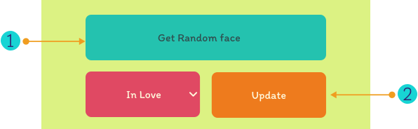

 

 

 

Change to:&nbsp; &nbsp; 

---

# FunFace
Esta página es hacerte sonreír!!! FunFace fué desarrollada con **Html, CSS**, y **JS**. También diseñada y prototipada en **Figma**. &nbsp; &nbsp; 

 

   &nbsp;  &nbsp; &nbsp;
  Detalles de la app:

### Aleatorio:

 > en la app se implementaron características para cambiar de forma aleatoria como son:
  - **Color de fondo:**  &nbsp; modificado a través de javascript la propiedad background-color representado en rgb.
  - **Emoji**  &nbsp; establecido por la app con javascript, establece un número aleatorio que corresponde al índice del emoji en la lista.

 

 

## Functionalidades:

### Menú desplegable:

despliega un menú con las opciones de emoji. 

 

 

### Botón:
1. get random face: muestra un emoji aleatorio en la página, cada vez que se le hace click. 
2. Update: Establece el emoji previamente seleccionado en el menú desplegable. 

 

 

### Fondo: 
Cambia al cambiar el emoji que se muestra en pantalla.
