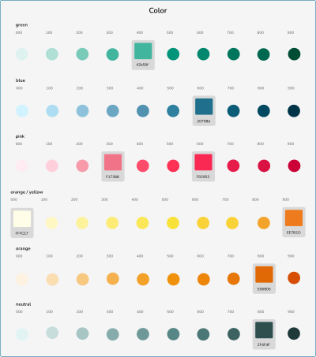
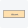
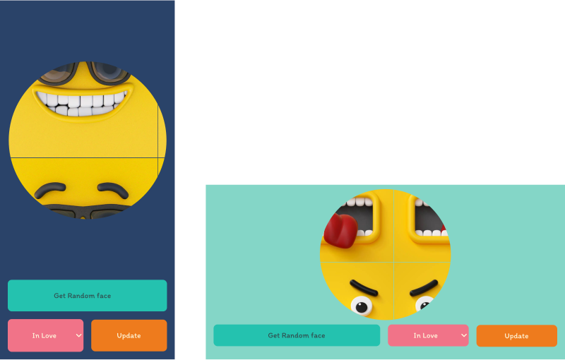
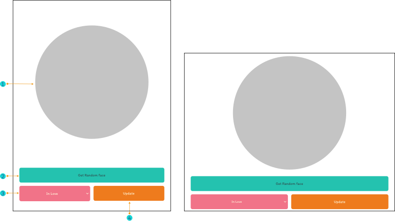
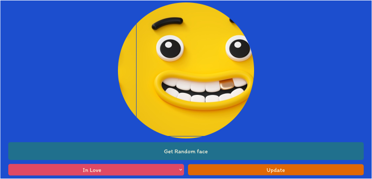
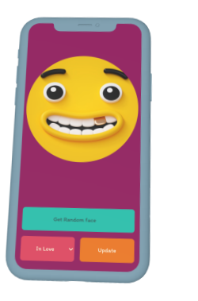

 

 

 

Cambiar a:&nbsp; &nbsp; 

---

# FunFace
Esta página es hacerte sonreír!!! FunFace fué desarrollada con **Html, CSS**, y **JS**. También diseñada y prototipada en **Figma**. &nbsp; &nbsp; 

 

   &nbsp;  &nbsp; &nbsp;
  Detalles de la app:

### Aleatorio:

 > en la app se implementaron características para cambiar de forma aleatoria como son:
  - **Color de fondo:**  &nbsp; modificado a través de javascript la propiedad background-color representado en rgb.
  - **Emoji**  &nbsp; establecido por la app con javascript, establece un número aleatorio que corresponde al índice del emoji en la lista.

 

 

## Functionalidades:

### Menú desplegable:

despliega un menú con las opciones de emoji. 

 

 

### Botón:
1. get random face: muestra un emoji aleatorio en la página, cada vez que se le hace click. 
2. Update: Establece el emoji previamente seleccionado en el menú desplegable. 

 

 

### Fondo: 
Cambia al cambiar el emoji que se muestra en pantalla.

 

 

<h2 id="design">Diseño:</h2>

 &nbsp; &nbsp;  &nbsp; &nbsp; Colores:

### Paleta de colores:
La paleta de colores usada en el proyecto incluye colores brillantes para generar emoción y energía.

Variaciones de color usadas para crear la paleta de colores.

 

### Detalles de color:
Informacion mostrada en el sistema de diseño para mantener la coherencia visual de la aplicación.

 

 

- **Category:** muestra la categoría y/o nombre general del color.
- **Color sample:** es la representación visual que corresponde al color.
- **Color hex value:** es el nombre del color en nomenclatura hexadecimal.
- **Color naming:** representa la convención usada para nombrar colores en el sistema de diseño del proyecto.

 

<a href="#design">Volver a la sección Diseño</a>

 

 &nbsp; &nbsp;  &nbsp; &nbsp; Tipografía:

 

familia tipográfica usada en la app.

 

Documentación de familias tipográficas en el sistema de diseño.

 

Información de las familias tipográficas mostrada en el sistema de diseño incluyen: font-family, font-weight, font-size y letter-spacing. Esta es la misma información usada en la maquetación de la app.

 

<a href="#design">Volver a la sección Diseño</a>

 

 &nbsp; &nbsp;  &nbsp; &nbsp; Componentes:

 

Especificaciones del botón de "Get Random face" en el sistema de diseño.

 

<a href="#design">Volver a la sección Diseño</a>

 

 &nbsp; &nbsp;  &nbsp; &nbsp;  Wireframes:

 

> Los Wireframes son prototipos de baja fidelidad (poco detalle) que sirven cómo guía visual y representan el esqueleto de una página y/o componente.

 

## Aplicación FunFace:

### Prototipo de móvil

### Detalles: 

**1. &nbsp; &nbsp; Imagen de emoji:** es la imagen mostrada en la aplicación. 
**2. &nbsp; &nbsp; Botón Get Random face:** permite cambiar la imagen mostrada aleatoriamente. 
**3. &nbsp; &nbsp; Menú desplegable:** contiene las opciones de imagen disponibles. 
**4. &nbsp; &nbsp; Botón de Update:** establece como imagen la opción seleccionada en el menú desplegable. 

Diseño de prototipo de móvil

 

### Wireframe en alta fidelidad:

 

 

<a href="#design">Volver a la sección Diseño</a>

 

---

 

### Prototipo de tablet

### Detalles: 

**1. &nbsp; &nbsp; Imagen de emoji:** es la imagen mostrada en la aplicación. 
**2. &nbsp; &nbsp; Botón Get Random face:** permite cambiar la imagen mostrada aleatoriamente. 
**3. &nbsp; &nbsp; Menú desplegable:** contiene las opciones de imagen disponibles. 
**4. &nbsp; &nbsp; Botón de Update:** establece como imagen la opción seleccionada en el menú desplegable. 

Diseño de prototipo de tablet

 

### Wireframe en alta fidelidad:

 

 

<a href="#design">Volver a la sección Diseño</a>

 

---

 

### Prototipo de pc

### Detalles: 

**1. &nbsp; &nbsp; Imagen de emoji:** es la imagen mostrada en la aplicación. 
**2. &nbsp; &nbsp; Botón Get Random face:** permite cambiar la imagen mostrada aleatoriamente. 
**3. &nbsp; &nbsp; Menú desplegable:** contiene las opciones de imagen disponibles. 
**4. &nbsp; &nbsp; Botón de Update:** establece como imagen la opción seleccionada en el menú desplegable. 

Diseño de prototipo de pc

 

### Wireframe en alta fidelidad:

 

 

<a href="#design">Volver a la sección Diseño</a>

 

---

 

## Prototipo interactivo:

 

<a href="https://www.figma.com/proto/fV01fBdBQbbT5fScqf7ro1/FunFace?page-id=15%3A772&node-id=15-933&viewport=758%2C109%2C0.05&scaling=scale-down&starting-point-node-id=15%3A1603&mode=design&t=el8vVvA5SLjxGeeg-1" target="_blank">
</a>

 

> Haz click en la imagen para probar el prototipo interactivo en Figma.  &nbsp; &nbsp; 👆

 

## Lenguajes y herramientas:

Usados en el desarrollo del proyecto:

 &nbsp; &nbsp;
 &nbsp; &nbsp;
 &nbsp; &nbsp;

 

Empleados en el diseño del proyecto:

 

## Profesionales:

<a href="https://www.linkedin.com/in/mariangelicarodriguezperez/">

</a>

---

  

© Mariangelica Rodriguez

 &nbsp; &nbsp;
 &nbsp; &nbsp;

 

