

 

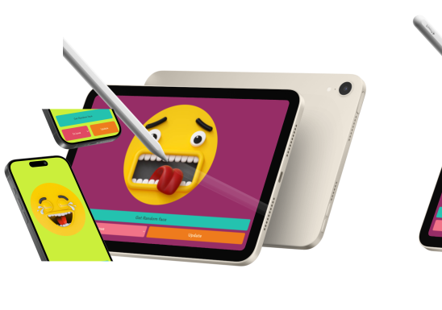

 

 

Change to:&nbsp; &nbsp; 

---

# FunFace
This is a page make you smile!!! FunFace was built with **Html, CSS**, and **JS**, also designed and prototypes on **Figma**. &nbsp; &nbsp; 

 

   &nbsp;  &nbsp; &nbsp;
  App details:

### Randomly:

 > In the application, features were implemented to change randomly, such as:
  - **Background color:**  &nbsp; the **CSS** background-color property represented in its rgb value was modified using  **Javascript**.
  - **Emoji**  &nbsp; established by the app with **Javascript**, sets a random number that corresponds to the index of the emoji in the list. 

 

 

## Functionalities:

### Dropdown:

Displays a menu with emoji options. 

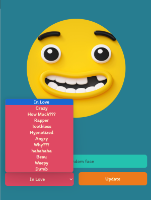

 

### Button:
1. Get random face: Show a random emoji on the page every time it is clicked. 

2. Update: Sets the previously selected emoji in the selector menu. 

 

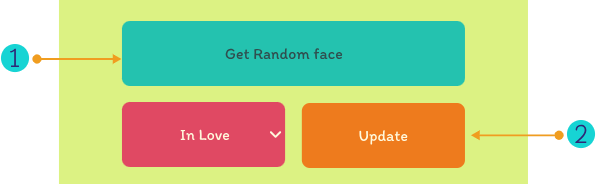

 

### Background:
Changes randomly when the emoji on the screen also change.

 

  

<h2 id="design">Design:</h2>

 &nbsp; &nbsp;  &nbsp; &nbsp; Colors:

### Color palette:
The color palette used in the project includes bright colors to generate emotions and energy.

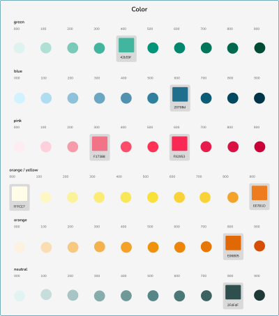

Color variations were used for color palette creation.

 

### Color details:
Information shown in the design system to maintain the visual coherence of the app.

 

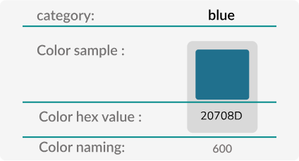

 

- **Category:** Shows the color category and general name.
- **Color sample:** it is a visual representation of the corresponding color.
- **Color hex value:** it’s the code name of the color in hexadecimal nomenclature.
- **Color naming:** represents the naming conventions used in the design system of the project.

 

<a href="#design">go back to design section</a>

 

 &nbsp; &nbsp;  &nbsp; &nbsp; Typography:

 

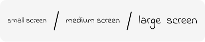

Typography family used in the app.

 

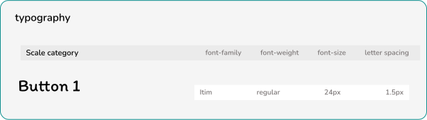

Typography documentation in the design system.

 

The typography information shown in the design system includes font-family, font-weight, font-size and letter-spacing. This is the same information used in web development.

 

<a href="#design">go back to design section</a>

 

 &nbsp; &nbsp; 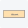 &nbsp; &nbsp; Components:

 

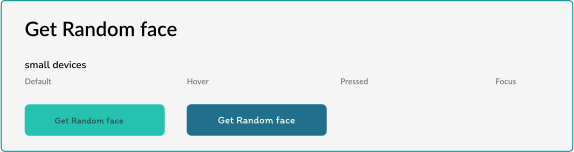

Get Random face button documentation shown in the design system.

 

<a href="#design">go back to design section</a>

 

 &nbsp; &nbsp;  &nbsp; &nbsp;  Wireframes:

 

> Wireframes are prototypes that serve as a visual guide that represents the skeletal framework of the game.

 

## FunFace application:

### mobile prototype

### Details: 

**1. &nbsp; &nbsp; Emoji image:** it is the image displayed in the application. 
**2. &nbsp; &nbsp; Botón Get Random face:** allows the user to change the shown image randomly. 
**3. &nbsp; &nbsp; Menú desplegable:** displays available image options. 
**4. &nbsp; &nbsp; Botón de Update:** Sets the selected option in the dropdown menu as the current image.
 

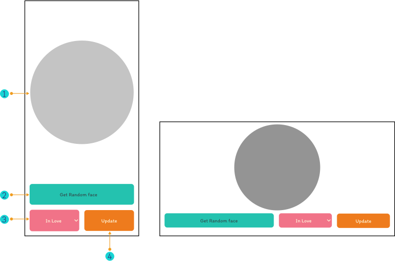

Moile layout design

 

### Wireframe in high fidelity:

 

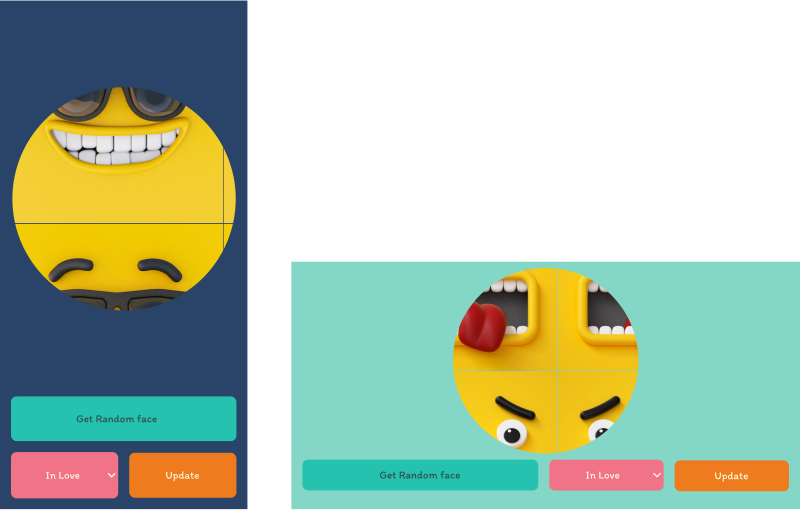

 

<a href="#design">go back to design section</a>

 

---

 

### Tablet prototype

### Details: 

**1. &nbsp; &nbsp; Emoji image:** it is the image displayed in the application. 
**2. &nbsp; &nbsp; Botón Get Random face:** allows the user to change the shown image randomly. 
**3. &nbsp; &nbsp; Menú desplegable:** displays available image options. 
**4. &nbsp; &nbsp; Botón de Update:** Sets the selected option in the dropdown menu as the current image.
 

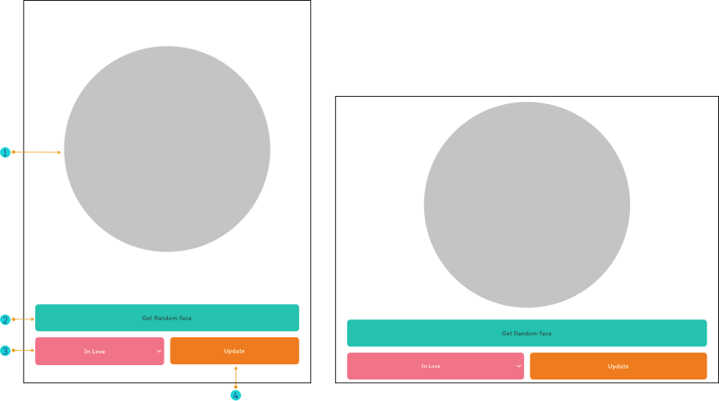

Tablet layout design

 

### Wireframe in high fidelity:

 

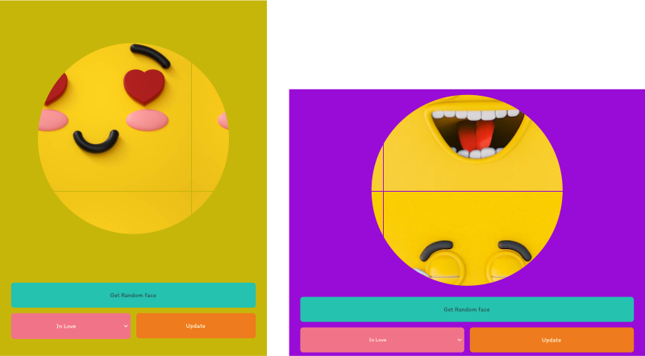

 

<a href="#design">go back to design section</a>

 

---

 

### Desktop prototype

### Details: 

**1. &nbsp; &nbsp; Emoji image:** it is the image displayed in the application. 
**2. &nbsp; &nbsp; Botón Get Random face:** allows the user to change the shown image randomly. 
**3. &nbsp; &nbsp; Menú desplegable:** displays available image options. 
**4. &nbsp; &nbsp; Botón de Update:** Sets the selected option in the dropdown menu as the current image.
 

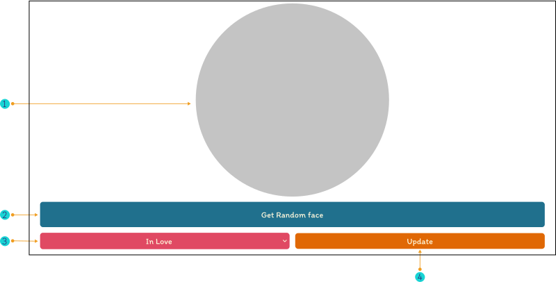

Desktop layout design

 

### Wireframe in high fidelity:

 

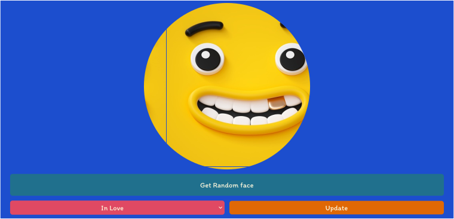

 

<a href="#design">go back to design section</a>

 

---

 

## Interactive prototype:

 

<a href="https://www.figma.com/proto/fV01fBdBQbbT5fScqf7ro1/FunFace?page-id=15%3A772&node-id=15-933&viewport=758%2C109%2C0.05&scaling=scale-down&starting-point-node-id=15%3A1603&mode=design&t=el8vVvA5SLjxGeeg-1" target="_blank">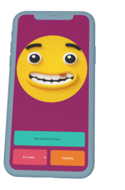
</a>

 

> Click the image and try the prototype of the game made in Figma. &nbsp; &nbsp; 👆

 

## Languages and tools:

Used for the project development:

<a href="https://developer.mozilla.org/en-US/docs/Web/HTML" target="_blank">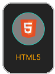</a> &nbsp; &nbsp;
<a href="https://developer.mozilla.org/en-US/docs/Web/CSS" target="_blank">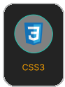</a> &nbsp; &nbsp;
<a href="https://developer.mozilla.org/en-US/docs/Web/JavaScript" target="_blank">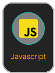</a> &nbsp; &nbsp;
<a href="https://github.com/about" target="_blank">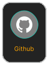</a>

 

Employed in the project design:

 

## Professionals:

<a href="https://www.linkedin.com/in/mariangelicarodriguezperez/">

</a>

---

  

© Mariangelica Rodriguez

 &nbsp; &nbsp;
 &nbsp; &nbsp;

 

