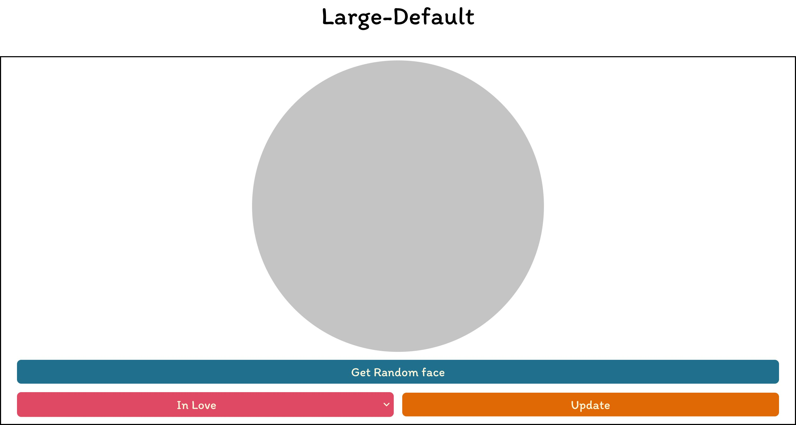
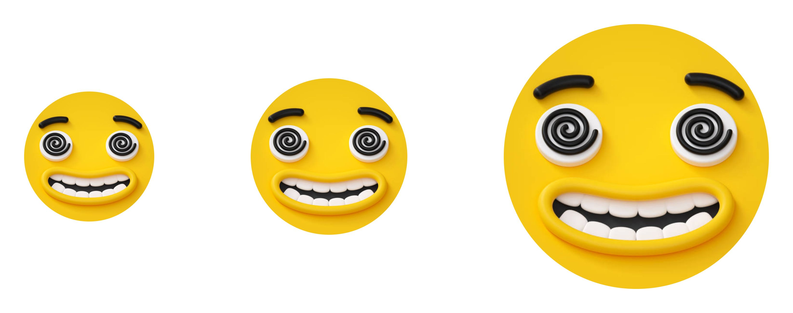

# FunFace
## A page for bringing you a smile!!!
And other expressions, FunFace is an interactive page with a user-friendly experience for users. Built with **Html, CSS**, and **JS**, also designed and prototyped on **Figma**.
 
### Layout Designs

 
*[Interactive Prototype of Mobile](https://www.figma.com/proto/fV01fBdBQbbT5fScqf7ro1/FunFace?page-id=15%3A772&node-id=15%3A1603&viewport=1405%2C576%2C0.12&scaling=scale-down&starting-point-node-id=15%3A1603).*
 

 

 
### Image samples
